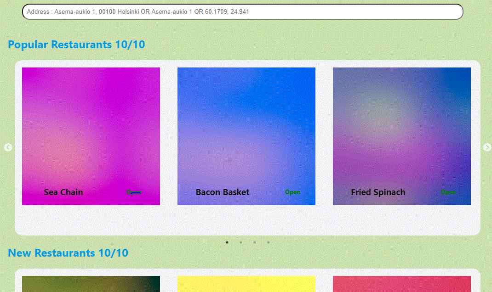
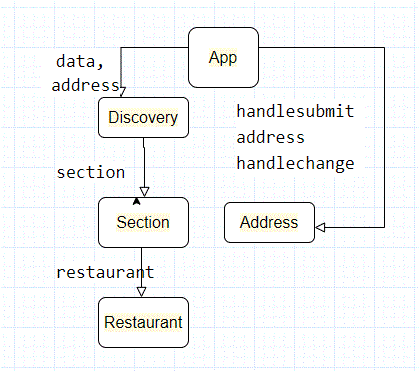

<h1 align="center">Wolt 2021 Internship Assignment</h1>

<p align="center">
  

  

  

  
</p>

<p align="center">
  <a href="#dart-about">About</a> &#xa0; | &#xa0; 
  <a href="#sparkles-features">Features</a> &#xa0; | &#xa0;
  <a href="#rocket-technologies">Technologies</a> &#xa0; | &#xa0;
  <a href="#white_check_mark-requirements">Requirements</a> &#xa0; | &#xa0;
  <a href="#checkered_flag-starting">Starting</a> &#xa0; | &#xa0;
  <a href="#memo-license">License</a> &#xa0; | &#xa0;
  <a href="https://github.com/VincentLimo" target="_blank">Author</a>
</p>

<br>

<div align="center" id="top"  style="
  height: 250px;
  overflow: scroll;" > 
  

&#xa0;

</div>

## :dart: About

This project is a solution to Wolt Summer 2021 Internship [Preliminary Assignment](https://github.com/woltapp/summer2021-internship) using Express and React in backend and frontend respectively. I had a lot of fun (and interesting challenges) completing this assignment to an extend I decided to make it 'full-stack'. Essential part is in the backend. Frontend part of the project was bootstrapped with [Create React App](https://github.com/facebook/create-react-app).

## :sparkles: Features

:heavy_check_mark: frontend dependency libraries

1. axios: 0.21.1       - for fetching
2. data blurhash: 1.1.3     - placeholders for images
3. react-blurhash: 0.1.3   - placeholders for images
4. slick-carousel: 1.8.1   - building responsive and customizable carousels/sliders
5. react-slick: 0.28.0    - building responsive and customizable carousels/sliders
6. react-geocode: 0.2.2   -  converting between geographic coordinates and addresses

:heavy_check_mark: backend dependency libraries

1.  cors: 2.8.5
2.  express: 4.17.1
3.  lodash: 4.17.20
4.  morgan: 1.10.0
5.  nodemon: 2.0.7
6.  geolib: 3.3.1

## :rocket: Technologies

The following tools were used in this project:

- [Node.js](https://nodejs.org/en/)
- [React](https://reactjs.org/)

## :white_check_mark: Requirements

Before starting :checkered_flag:, you need to have [Node](https://nodejs.org/en/) installed.

## :checkered_flag: Starting

```bash

# Clone this project
$ git clone https://github.com/LimoVincent/wolt-2021-internship-assignment


```

### Frontend

```bash

# Access
$ cd wolt-2021-internship-assignment
$ cd frontend

# Install frontend dependencies
$ npm i axios
$ npm i --save blurhash react-blurhash
$ npm i react-geocode
$ npm i npm install react-slick --save
$ npm i slick-carousel

# Run the project
$ npm start

# The server will initialize in the <http://localhost:3000>
```

### Backend

```bash
# Access
$ cd wolt-2021-internship-assignment
$ cd backend

# Install backend dependencies
$ npm i express
$ npm i cors
$ npm i geolib
$ npm i lodash
$ npm i morgan
$ npm i nodemon


# Run the project
$ npm run dev

# The server will initialize in the <http://localhost:3001>

# check for example;  <http://localhost:3001/api/discovery?lat=60.17091&lon=24.94101>

```

<div align="center"  >
  

&#xa0;

</div>

## :memo: License

This project is under license from MIT. For more details, see the [LICENSE](LICENSE.md) file.

Made with :heart: by <a href="https://github.com/LimoVincent/" target="_blank">Vincent</a>

&#xa0;

<a href="#top">Back to top</a>
